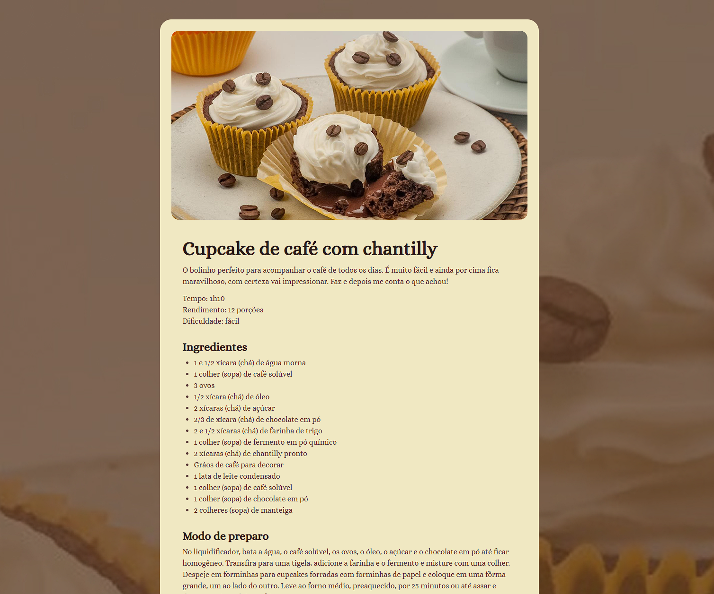

# Página de Receita

Página de receita em HTML e CSS, com foto, lista de ingredientes e modo de preparo.

Demo: https://theusan777.github.io/projeto-pagina-de-receita/

## Preview

<p align="center">
  
</p>

## Sobre o projeto

Página única mostrando a receita de um cupcake de café com chantilly: foto do prato, tempo de preparo, rendimento, dificuldade, lista de ingredientes e o modo de preparo passo a passo.

## Tecnologias

- HTML
- CSS

## Funcionalidades

- Exibição da receita completa (ingredientes e modo de preparo)
- Informações rápidas de tempo, rendimento e dificuldade

## Estrutura do projeto

```
index.html
assets/
  main-image.png
  Vector.svg
```

## Como executar

git clone https://github.com/theusan777/projeto-pagina-de-receita.git

Depois é só abrir o `index.html` no navegador.

## Deploy

[Acessar projeto](https://theusan777.github.io/projeto-pagina-de-receita/)

## Aprendizados

Projeto mais simples, focado em estruturar conteúdo de texto longo (lista de ingredientes, passo a passo) de forma legível com HTML semântico e CSS.
